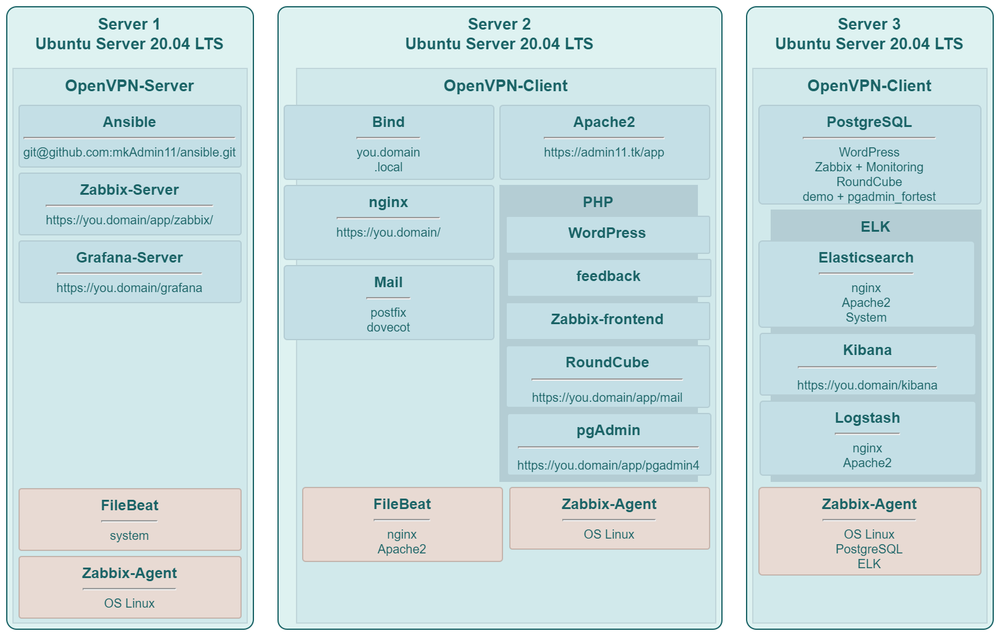

# SKILLFACTORY 21-22

## Дипломная работа профессии "Системный администратор Linux"

### Содержание

- [Задание](#Задание)
- [Графическая схема](#Графическая-схема)
- [Скрипты](#Скрипты)
- [Пояснительная записка](#Пояснительная-записка)

---

### Задание

Задание к проекту можно посмотреть [здесь](task.md#SKILLFACTORY-21-22).

> [!NOTE]
> Это не подробное задание, т.к. оно не находится в открытом доступе.  
> Здесь тезисно перечислено задание (скорее даже тезисное описание результата).

---

### Графическая схема

Итоговая графическая схема проекта:

---

### Скрипты
 
Используются виртуальные машины, созданные по шаблону _Yandex Cloud_, которые уже неплохо настроены.  
Но для автоматизации, перед прокаткой ролей в _ancyble_, написаны [скипты](scripts/).

---

### Пояснительная записка 

[Пояснение](explan.md#SKILLFACTORY-21-22) к прокатываемым ролям.

